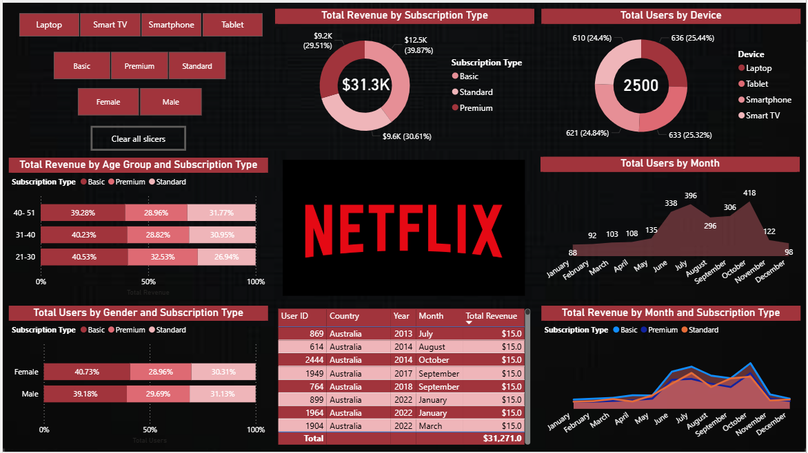

Netflix Userbase Analysis - Power BI Report

Overview

This Power BI report provides an in-depth analysis of Netflix's userbase, revenue, and subscription trends. It visually presents key insights on total revenue, user distribution, and other metrics using interactive slicers and charts.

Key Features

Total Revenue by Subscription Type: Displays the revenue generated from Basic, Standard, and Premium subscriptions.

Total Users by Device: Breakdown of users accessing Netflix via different devices (Laptop, Tablet, Smartphone, Smart TV).

Total Revenue by Age Group and Subscription Type: Highlights the revenue distribution across different age groups.

Total Users by Gender and Subscription Type: Compares the user base by gender for different subscription tiers.

Total Users by Month: Trends of user registrations over a calendar year.

Total Revenue by Month and Subscription Type: Tracks revenue fluctuations by subscription type throughout the year.

User Data Table: Displays sample user details, including country, year, month, and total revenue contribution.

Interactive Filters (Slicers)

Device selection (Laptop, Smart TV, Smartphone, Tablet)

Subscription Type (Basic, Premium, Standard)

Gender (Female, Male)

"Clear all slicers" button to reset selections

Visual Elements Used

Pie Charts: Used for displaying revenue and user distribution.

Bar Charts: Used for revenue distribution by age and gender.

Line & Area Charts: Depict trends over time.

Tables: Present detailed user and revenue data.

Insights

The Premium subscription generates the highest revenue.

Users access Netflix through a diverse range of devices, with almost equal distribution.

The younger demographic (21-30 years) contributes significantly to revenue.

There is a steady increase in users during mid-year months (July, August, October).
